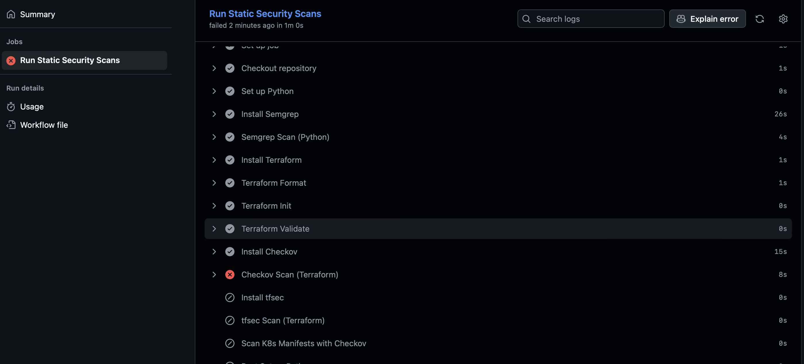
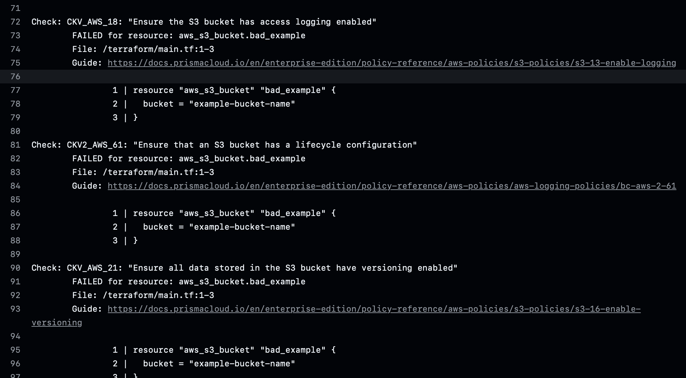
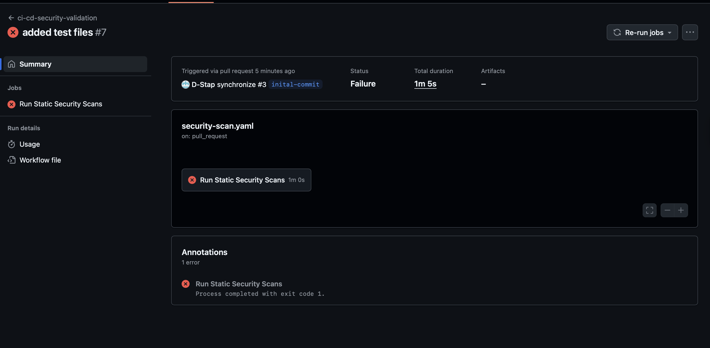

# security-pipeline
# CI/CD Security Validation

This project implements a secure CI/CD pipeline using **GitHub Actions** to automatically scan:

- Terraform Infrastructure as Code (IaC)
- Kubernetes manifests
- Python application code

The pipeline uses open-source tools to enforce security best practices and catch misconfigurations before deployment.

---

## 🛠 Tools Used

| Tool      | Purpose                        |
|-----------|--------------------------------|
| `terraform fmt/validate` | Format and validate IaC syntax |
| `Checkov` | Static analysis of Terraform/K8s |
| `tfsec`   | Terraform security analysis     |
| `Semgrep` | Python code static analysis     |

---

## ✅ What It Catches

- Misconfigured IAM policies, insecure resource definitions, or overly permissive rules in Terraform
- Hardcoded secrets or unsafe patterns in Python code
- Over-permissive RBAC in Kubernetes manifests
- CI pipeline misconfigurations (e.g., GitHub Actions permission issues)

---

## 📸 Demo Screenshot

